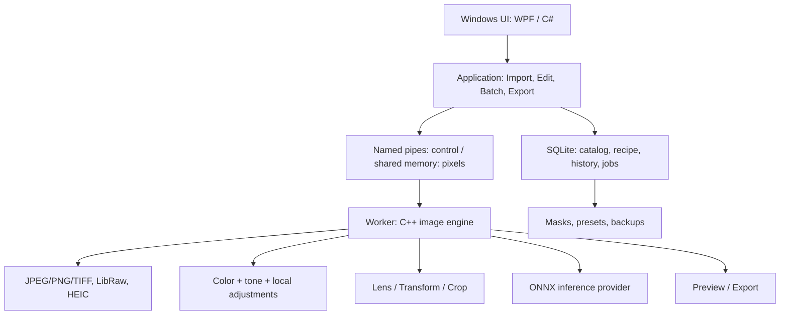

# Kiến trúc đề xuất
Trạng thái: kiến trúc production đề xuất; ADR-0001 đã chốt nền tảng/ràng buộc P0 và prototype Windows đã có mã smoke. Các lớp production đầy đủ vẫn chưa hoàn tất.

## 1. Các lớp


WPF phù hợp ứng dụng chỉ chạy Windows; dùng .NET 10 LTS và khóa SDK/patch khi P0. [WPF](https://learn.microsoft.com/en-us/dotnet/desktop/wpf/overview/) · [.NET support](https://dotnet.microsoft.com/en-us/platform/support/policy).

UI không xử lý pixel hoặc SQL trực tiếp. Application layer sở hữu commands, validation và transaction. Một catalog chỉ có một writer process; engine không tự ghi catalog. Worker lỗi có thể restart mà không mất thay đổi đã lưu.

## 2. Công nghệ và ranh giới
- C# / WPF / MVVM: library, panel, shortcuts, dialogs, task progress.
- C++20 / CMake: decode adapters, image math, masks, render, encode. C ABI giới hạn cho tích hợp; IPC có protocol version, job id, cancellation và lỗi có cấu trúc.
- SQLite trên đĩa local: catalog, migration, WAL/backup qua API phù hợp. Cache ảnh nằm ngoài DB. Không đặt catalog đang mở trên network share.
- LibRaw đọc dữ liệu/metadata RAW; production rendering là công việc riêng, không được coi bản convert mặc định là engine hoàn chỉnh. [Giới hạn LibRaw](https://www.libraw.org/).
- JPEG/PNG/TIFF dùng adapter codec đã kiểm thử, có thể WIC trong spike; HEIC dùng libheif với decoder được đóng gói/kiểm tra riêng. [libheif](https://github.com/strukturag/libheif).
- Lensfun cho profile và hiệu chỉnh quang học; LittleCMS cho ICC. [Lensfun](https://github.com/lensfun/lensfun) · [LittleCMS](https://www.littlecms.com/).
- CPU là baseline đúng kết quả. GPU Direct3D compute chỉ đưa vào khi P0 chứng minh lợi ích và tính tương đương; không biến GPU thành điều kiện để mở catalog.
- AI qua interface model/provider; đánh giá ONNX Runtime CPU và WinML cho Windows. DirectML là lựa chọn tương thích khi phù hợp; không cố định toàn bộ thiết kế vào nó. Tài liệu ONNX hiện ưu tiên WinML cho phát triển mới trên Windows. [Windows inference](https://onnxruntime.ai/docs/get-started/with-windows.html).
- Không dùng Python làm runtime bắt buộc của bản cài; có thể dùng trong nghiên cứu/calibration. Không cần API server hoặc hệ thống cloud.

## 3. Pipeline ảnh dùng chung
Đầu vào RAW → giải nén/black-level/white-level/điểm lỗi → WB sensor + demosaic → camera color transform → không gian làm việc RGB tuyến tính gamut rộng float32.
JPEG/PNG/HEIC → decode đủ bit depth/alpha → nhận ICC/nclx → chuyển sang cùng working space. Không biến JPEG thành RAW. HDR HEIC nếu chưa hỗ trợ phải báo rõ và có đường chuyển SDR đã kiểm thử.

Graph dự kiến:
1. Chuẩn hóa orientation và hệ tọa độ.
2. Hiệu chỉnh vignette tuyến tính khi dữ liệu hợp lệ.
3. Basic tone, highlight handling và camera rendering profile.
4. Curve/HSL/Point Color trong miền màu được định nghĩa cho từng node.
5. Local adjustments dựa trên mask cùng hệ tọa độ ảnh chưa crop.
6. Warp kết hợp distortion/TCA/transform/rotation/crop để tránh resample nhiều lần.
7. Output resize → watermark có quản lý màu/alpha → output color transform/quantize → encode; preview thay đuôi này bằng display ICC transform.

WB/một số xử lý cảm biến nằm trước demosaic; vị trí thuật toán local/curve có thể tinh chỉnh trong P0/P3, sau đó phải khóa bằng processVersion. Exposure hoạt động trên ánh sáng tuyến tính, HSL/curve không tùy tiện áp trực tiếp lên gamma sai. Xử lý float không clamp sớm, chỉ gamut mapping/clamp hợp lý ở đầu ra.

Preview và export dùng cùng graph/recipe, khác độ phân giải/chất lượng lấy mẫu. Thumbnail nhúng RAW chỉ dùng duyệt nhanh, không dùng làm nguồn export. Có thể progressive preview rồi refine 100%; ảnh xem trước phải thể hiện trạng thái refine.

Không dùng ICC thay cho camera input profiling: RAW cần ma trận/profile đầu vào, WB và chính sách highlight riêng. Matrix của decoder chỉ là baseline; benchmark màu da, ánh sáng hỗn hợp, màu bão hòa quyết định khả năng phát hành.

## 4. Hiệu năng
Tile/ROI, mipmap và LRU cache có ngân sách RAM/VRAM. 61 MP RGB float32 đã khoảng 732 MB cho một buffer; không giữ nhiều bản full-resolution mỗi ảnh.
Decode RAW có thể cần buffer toàn ảnh; scheduler giới hạn job theo peak memory ước tính, không chỉ số core. Export xếp hàng giới hạn song song.
Kéo slider: hủy render cũ, trả preview phân giải thấp nhanh, refine khi thả. Kết quả stale không được thay ảnh mới đang xem.
Cache key: source fingerprint + recipe hash + processVersion + lens DB/profile version + model/mask hash + size + display profile.
Zoom 100% dùng tile độ phân giải gốc. Các filter cục bộ có halo quanh tile; kiểm tra seam giữa tile.

## 5. Dữ liệu cốt lõi
| Entity | Trường và ràng buộc chính |
|---|---|
| Asset | id, path, fingerprint, dimensions, orientation, metadata, missing state |
| ImportSession / ImportItem | session id, status, asset id, outcome, source folder |
| Collection / CollectionItem | id, name; unique(collectionId, assetId) |
| CatalogSettings | targetCollectionId hợp lệ hoặc null |
| EditRevision | assetId, revisionId, parent, recipe JSON, schema/process version |
| BatchOperation / BatchItem | id, selected snapshot, before/after revision, status |
| Preset | id, name, schemaVersion, selectedFields, values |
| Mask | id, assetId, source coordinates, stroke data, raster asset hash, model version |
| ExportJob / ExportItem | frozen settings, recipe revision, source fingerprint, destination, status |

Recipe là dữ liệu có version, không chứa code thực thi. Mỗi node có defaults rõ ràng. Schema JSON và migration kiểm tra min/max, enum, field không hỗ trợ. Không im lặng bỏ field khi mở bằng engine cũ.
Asset không có flag “selected” dùng chung toàn catalog; selection thuộc context UI. Persistent change được commit theo command; kéo slider gom thành một lịch sử khi kết thúc thao tác.

Catalog folder dự kiến:
```text
catalog.sqlite
assets/masks/
assets/watermarks/
profiles/
cache/                 # tái tạo được
backups/               # DB + durable assets + manifest
```
Ảnh gốc có thể ngoài catalog. Backup catalog không đồng nghĩa backup ảnh gốc; UI phải ghi rõ phạm vi.

## 6. Batch và phục hồi
Copy payload gồm source recipe snapshot + selected field paths + compatibility metadata, không chỉ id ảnh nguồn.
Paste tạo operation id, chốt asset ids + before revisions; kiểm tra trước, áp theo chunk transaction, ghi journal cho từng mục. Retry idempotent theo operation/item id.
Nếu worker crash thì recipe đã commit vẫn tồn tại; cache tái tạo sau. Undo phục hồi before revisions có kiểm tra conflict.
Export dùng snapshot riêng. Ghi .partial ở cùng đích rồi atomic rename khi encode thành công; không để file hỏng mang tên ảnh hoàn tất. Khi nguồn thay đổi sau enqueue, báo stale và yêu cầu tạo lại item.
Catalog migration: backup nhất quán trước upgrade; chạy trên bản copy nếu migration lớn; old app từ chối schema mới. Rollback dùng app cũ + backup tương ứng, không chỉ thay .exe.

## 7. Mask và AI
Brush lưu tọa độ chuẩn hóa theo ảnh gốc đã orientation, trước warp/crop. Canvas dùng inverse transform ánh xạ nét vẽ; mask được warp cùng ảnh nên crop/straighten không làm lệch vùng.
Mask asset immutable/content-addressed; undo tham chiếu version trước. Garbage collection chỉ khi không còn revision/backup cần.
Model segmentation không mặc nhiên xác định “chủ thể chính”. P0/P6 so sánh semantic/foreground detector và mô hình tương tác như SAM 2; có thể cần detector hoặc gợi ý click trước refine. SAM 2 là ứng viên promptable, không phải giải pháp một nút hoàn chỉnh. [SAM 2](https://github.com/facebookresearch/sam2).
Chọn model sau benchmark, kiểm tra code lẫn weights/license, khả năng export ONNX/opset/provider và tốc độ. Chưa cam kết một model cụ thể.
AI background là complement của subject trong miền ảnh hợp lệ. Brush refine lưu thành lớp bổ sung. Chạy lại AI sau copy không được mang raster mask nguồn sang ảnh khác.
Model tải/cài riêng có hash/version, kiểm tra toàn vẹn; sau khi có model, xử lý ảnh offline. Máy thiếu GPU có CPU fallback chậm hơn và luôn dùng được manual mask.

## 8. Cấu trúc repository dự kiến
```text
src/MisaImageEditor.Desktop/
src/MisaImageEditor.Application/
src/MisaImageEditor.Domain/
src/MisaImageEditor.Infrastructure/
native/ImageEngine/
native/ImageWorker/
contracts/recipes/  contracts/ipc/
tests/unit/  tests/integration/  tests/golden/  tests/e2e/
tools/benchmarks/  packaging/
docs/  memory-bank/  handoff/
```
Ảnh thật của người dùng không commit vào repository. Fixture dùng quyền phù hợp và manifest hash. Khóa phiên bản dependency, lens data, model để tái lập kết quả.
